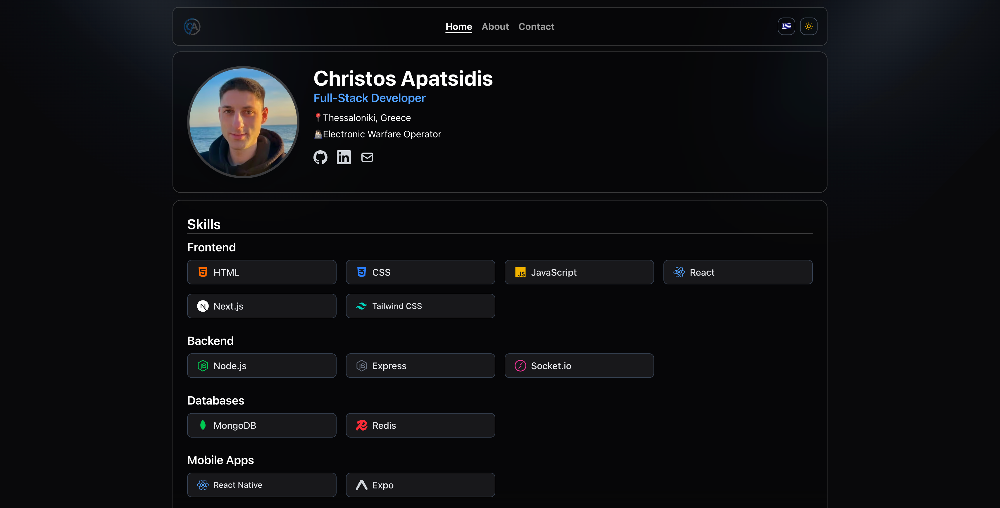

# Christos Apatsidis Portfolio
Welcome to my personal portfolio! Built with Next.js, React, TypeScript, Tailwind CSS, and Framer Motion, this site highlights my projects, skills, and ways to contact me. All in a modern, animated, and accessible interface!

## Features
- Animated backgrounds and glassmorphism UI
- Projects grid with interactive cards and image sliders
- Responsive design for all devices
- Light and dark theme support
- Accessible and SEO-friendly
- Contact form with validation

## Project Structure
- `app/` — Next.js app directory (pages, routes, layouts)
- `components/` — Reusable UI components
- `public/` — Static assets (images, icons, etc.)
- `types/` — TypeScript types
- `lib/` — Utility functions and libraries

## Screenshots
Screenshots for each project are stored in `public/projects/<project-name>/` and are displayed in animated sliders on each project page.

## License
This project is open source and available under the MIT License.
